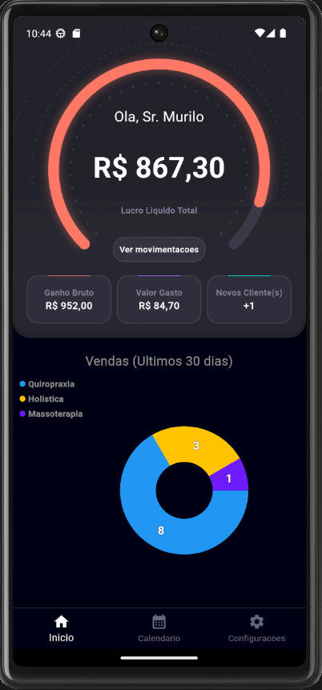
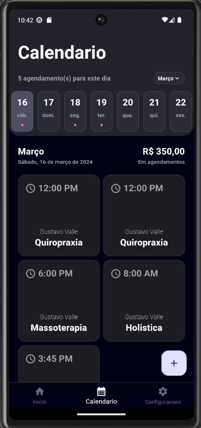
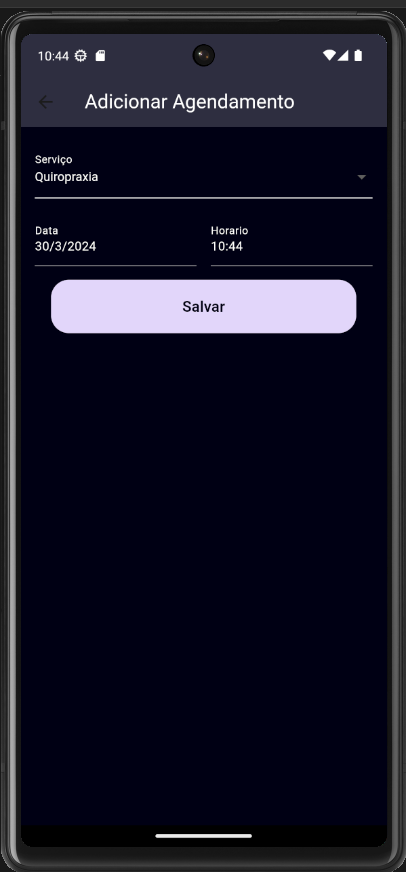

# Management System App

Welcome to the README for the Management System App! This is a private app project designed to facilitate various management tasks within a company. The app provides an admin panel for overseeing sales, managing users, scheduling services, and tracking daily appointments. 

## Features

### Admin Panel
- **Sales Overview**: Get a comprehensive view of sales performance.
- **New Users**: Manage new user registrations.
- **Service Scheduling**: Schedule services for customers.
- **Daily Appointment Tracking**: Keep track of daily appointments for efficient management.

## Future Features
In the future, we plan to implement the following features:
- **Creation and Management of Promotions**: Easily create and manage promotional campaigns.
- **User Retention and Segmentation Campaigns**: Run targeted campaigns for user retention and segmentation.
- **Product Inventory Management**: Maintain and control product inventory effectively.

## Upcoming Features
Further down the line, we aim to introduce:
- **User Interface for Customers**: Provide a user-friendly interface for customers to access services, schedule appointments, and make payments through the app.

## Screenshots

### Sales Overview

### Daily Appointment Tracking

### Service Scheduling

## Contributors
- Gustavo Valle [@gustavovalle](https://github.com/gustavovalle23)

## Issues and Feedback
If you encounter any issues with the app or have any feedback, please feel free to [open an issue](https://github.com/gustavovalle23/management-system-public/issues). We welcome contributions and suggestions from the community.

---
